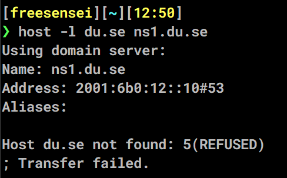
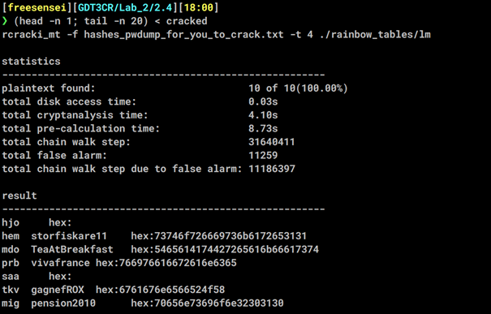
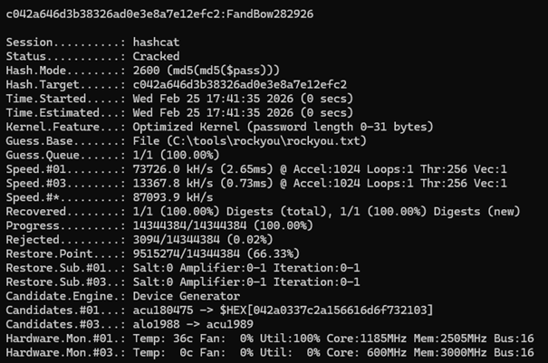

# Lab 2 – Information Gathering and Parallel Hash/Crypto Attacks

**Course:** Ethical Hacking (GDT3CR)  


**Platform:** Raspberry Pi 4  


**Operating System:** Kali Linux  


**User:** freesensei

---


# 2.1 Information Gathering via DNS Reconnaissance

## 2.1a Information Collection with DMitry

### Objective
To gather publicly available intelligence about a target domain using passive reconnaissance techniques.

### Tool Used

- `dmitry` (Deepmagic Information Gathering Tool)

### Description

DMitry is a UNIX/Linux command-line tool designed to collect:

- Subdomains
- Email addresses
- Whois information
- TCP port information
- Host uptime data

### Example Command

```bash
dmitry -winse <target-domain>
```


---

## 2.1b DNS Zone Transfer (AXFR)

### Step 1 – Identify Authoritative Name Servers

```bash
host -t ns <target-domain>
```

### Step 2 – Attempt Zone Transfer

```bash
host -l <target-domain> <nameserver>
```

### Result

The zone transfer attempt resulted in:

- `Transfer failed`
- or `Refused`

This indicates proper DNS hardening and correct server configuration.

### Security Implication

A successful zone transfer would expose:

- Internal hostnames
- Subdomains
- Infrastructure structure



---

## 2.1c Identifying Secondary and Tertiary DNS Servers (Without DMitry)

Secondary and tertiary DNS servers were identified using:

```bash
dig ns <target-domain>
```

or

```bash
nslookup -type=ns <target-domain>
```

These queries reveal all authoritative name servers for the domain.

---

# 2.2 Target Scanning with Nmap

## 2.2a TCP Connect Scan (-sT)

### Command Used

```bash
nmap -sT -Pn <target-ip>
```

### Description

- Performs full TCP three-way handshake
- Highly reliable
- Easily logged and detected

### Findings

- Most ports: Filtered
- Open ports detected:
  - 2000 (Cisco SCCP)
  - 5060 (SIP)

This suggests a VoIP-related infrastructure.

---

## 2.2b TCP SYN Scan (-sS)

### Command Used

```bash
sudo nmap -sS -Pn <target-ip>
```

### Description

- Half-open scan
- Faster and stealthier
- Requires root privileges

### Findings

Results matched the TCP connect scan.

---

## 2.2c UDP Scan

### Command Used

```bash
sudo nmap -sU -Pn <target-ip>
```

### Observations

- Ports reported as `open|filtered`
- UDP 5060 (SIP)
- Likely DNS (53), NTP (123), DHCP (67)

Due to UDP’s stateless nature, results are less deterministic.

---

## 2.2d OS Detection (OS Fingerprinting)

### Command Used

```bash
sudo nmap -sS -Pn -O <target-ip>
```

### Result

Nmap returned:

> No exact OS matches for host

### Analysis

Reasons include:

- Strict firewall filtering (997/1000 ports filtered)
- No UDP responses
- Hardened configuration

---

## 2.2e OS and Service Assessment

Based on gathered evidence:

The system is likely:

- Hardened Linux-based system
- Acting as VoIP gateway or IP-PBX server

### Identified Services

- TCP 5060 – SIP
- TCP 2000 – Cisco SCCP
- UDP infrastructure services (DNS, DHCP, NTP)

---

# 2.3 Vulnerability Scanning

## Tool Selection

Nmap with NSE (Nmap Scripting Engine) was chosen due to:

- Flexibility
- Strong documentation
- Script extensibility

### Example Command

```bash
sudo nmap -sS -sV -Pn --script=vuln <target-ip>
```

### Observations

- Two open TCP ports detected
- Majority filtered
- ICMP blocked (required -Pn)

The system appears hardened with minimal exposed attack surface.

---

# 2.4 Cracking Hashes with Rainbow Tables

## Objective

Crack LM hashes using pre-generated rainbow tables.

## Tool Used

- `rcracki_mt`

### Command Used

```bash
rcracki_mt -f hashes.txt -t 4 ./rainbow_tables/lm
```

### Results

- 10/10 hashes cracked
- Total time: ~4 seconds
- False alarms: 11,259
- Chain walk steps: 31,640,411

### Analysis

LM hashes are:

- Case-insensitive
- Limited to 14 characters
- Cryptographically weak

Rainbow tables dramatically reduce cracking time compared to brute force.



---

# 2.5 Cracking Hashes with Parallel Computing (Hashcat)

## 2.5a First Hash

### Command Used

```bash
hashcat -O -m 2600 -a 0 <hash> rockyou.txt
```

### Result

`c042a646d3b38326ad0e3e8a7e12efc2`:`FandBow282926`



---

## 2.5b Second Hash – Mask Attack

### Analysis

Password characteristics:

- 12 characters
- 1 uppercase letter
- Lowercase letters
- Special character (- or _)
- Ends with 4-digit year (2000–2026)

### Hash Identification

```bash
hashcat --identify <hash>
```

### Final Command Used

```bash
hashcat -m 900 -O <hash> -a 3 -1 -_ ?u?l?l?l?l?l?l?1?d?d?d?d
```

### Result

```
a1a7d311c5f1417694b07cbb47d08f00:Happier-2025
```

### Analysis

The hash was successfully cracked after identifying it as MD4-based rather than NTLM.

This highlights:

- Importance of correct hash mode
- Power of reduced keyspace
- Efficiency of mask-based attacks

---

# 2.8 Lab Reflection

## Relevance

This lab provided practical insight into:

- OSINT techniques
- DNS reconnaissance
- Network scanning methodologies
- OS fingerprinting limitations
- Vulnerability scanning strategies
- Cryptographic weaknesses in legacy hash algorithms
- GPU-accelerated password cracking

The lab effectively demonstrated real-world attacker methodology.

---

## Suggested Improvements

Possible improvements:

- More structured guidance for vulnerability scanners
- Preconfigured virtual targets for comparison
- Additional discussion on defensive countermeasures

---

## Ethical Disclaimer

All activities were conducted in controlled lab environments for educational purposes only.

No unauthorized systems were targeted.