# Lab5_Cloud_Attacks_and_Network_Techniques

**Student:** Isak Lagerberg  
**Course:** GDT3CR – Ethical Hacking  
**Lab:** 5  

---

## 5.1.3 Cloud Scanning

### IP Range Calculation

To estimate the number of possible IPv4 addresses in a cloud region, the provided script was used:

```bash
python3 countips.py oci_eu.txt
```

Result: `38400`

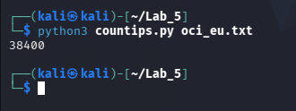

### Network Scan

A scan was performed on a private RFC1918 /16 network using `masscan` targeting TLS-related ports:

```bash
sudo masscan 10.0.0.0/16 -p443,3389 --rate 10000
```

Output:
```bash
Starting masscan...
Initiating SYN Stealth Scan
Scanning 65536 hosts [2 ports/host]
```

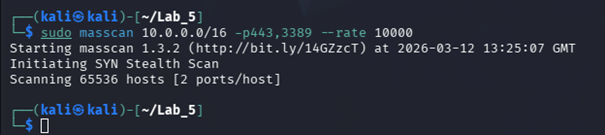

This demonstrates how large internal network ranges can be scanned efficiently in a cloud environment. However, such scanning may be restricted or monitored in real cloud environments.

## 5.1.4 Cloud Bucket Discovery
### Bucket Discovery Test

Tested bucket URL:
```bash
https://axgvurke2p6j.compat.objectstorage.eu-stockholm-1.oraclecloud.com/lab2-bucket
```

Command used:
```bash
curl -i https://axgvurke2p6j.compat.objectstorage.eu-stockholm-1.oraclecloud.com/lab2-bucket
```

Response:
```bash
HTTP/1.1 404 Not Found
Code: NoSuchBucket
```

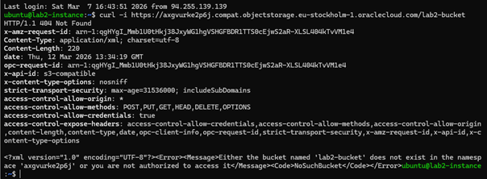

### Non-existing Bucket Test
A second test was performed with a non-existing bucket: `lab2-bucket123`

Command:
```bash
curl -i https://axgvurke2p6j.compat.objectstorage.eu-stockholm-1.oraclecloud.com/lab2-bucket123
```

Result:
```bash
HTTP/1.1 404 Not Found
Code: NoSuchBucket
```

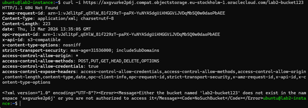

### Python Bucket Scanner (POC)
A simple Python script was created to automate bucket checks: `python3 bucket_scan.py`

Output:
```bash
lab2-bucket → 404
lab2-bucket123 → 404
```

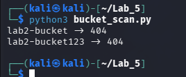

### Questions
#### 1. Can you find a bucket discovery tool for OCI?

There are currently few dedicated bucket discovery tools for Oracle Cloud Infrastructure (OCI).
Most existing tools primarily focus on AWS S3.

Therefore, a custom Python script can be used to test bucket existence by sending HTTP requests to the OCI object storage endpoint.

#### 2. Is it possible to distinguish between a private bucket and a non-existing bucket?

No.

Both private and non-existing buckets return the same response:
```bash
HTTP/1.1 404 Not Found
Code: NoSuchBucket
```

This is a security feature that prevents attackers from enumerating valid bucket names.


## 5.2 SANS - Cloud Application Attacks
A password spraying attack was carried out using the FireProx tool together with a PowerShell script called MSOLSpray and a small password list. The aim was to identify valid users and possibly weak passwords in the Microsoft 365 environment.

From the results (see screenshots below) several valid user accounts could be identified, but with incorrect passwords, as well as two valid passwords (one with MFA enabled):

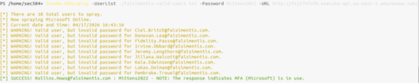
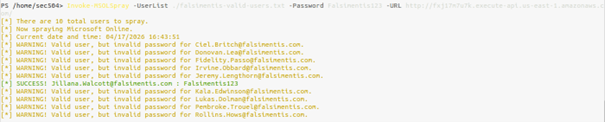

### Questions
#### a) Find all users from the 400 username list with passwords you could recover and report it.

**Successful password spray results:**

- Rollins.Hows@falsimentis.com : Mittens2022 (MFA enabled)
- Jillana.Walcott@falsimentis.com : Falsimentis123

The password spraying attack resulted in two valid credential pairs. One account required MFA, while the other allowed direct authentication.

#### b) If a user have MFA enabled for his/her MS 365 account, how could we potentially bypass this protection?
MFA can potentially be bypassed through missconfigurations, legacy authentication features or token/session abuse.

For example, legacy protocols such as IMAP or SMTP may not enforce MFA, conditional access policies can be misconfigured to exclude certain users or locations, and stolen session tokens can allow access without re-authentication.

## 5.2.2 Cloud SSRF/IMDS Attack
### Questions
#### a) Explain what the 169.254.169.254 IP-address really is and what it is used for in the cloud?
The IP address 169.254.169.254 is a link-local address used by cloud providers to host the Instance Metadata Service (IMDS). It is accessible only from within a cloud instance and provides information about the instance, such as configuration data, network details, and temporary security credentials (e.g., IAM roles). This service is commonly used by applications running on the instance to retrieve credentials and metadata without requiring external authentication.

#### b) How can you from an instance in your selected cloud (a real cloud, not an emulation) view the Instance Metadata Service (IMDS) credentials via curl?

The Instance Metadata Service (IMDS) is accessible from within the cloud instance via the link-local IP address 169.254.169.254. It provides metadata and configuration details about the instance.

In Oracle Cloud Infrastructure (OCI), the metadata service requires an authorization header to access the API.

A basic request without the header:
curl http://169.254.169.254

returns a restricted response (e.g., 404 or 403).

To retrieve metadata, the following command is used:

curl -H "Authorization: Bearer Oracle" http://169.254.169.254/opc/v2/instance/

This returns JSON data containing information such as:
- Agent configuration
- Enabled/disabled plugins
- Monitoring and management settings

The metadata service is only accessible from within the instance and must be accessed via the primary network interface (VNIC).

#### c) Try the SSRF/IMDS attack on your selected cloud tenancy using the included POC-script ssrf.py. Is it possible via the web browser to get some sensitive instance metadata when calling the script? If so what url, commands, code, etc. did you use in this case?
**Command:**
```bash
python3 ssrf_test.py
```
**Result:**
The SSRF proof-of-concept script was successfully executed against the Oracle Cloud Instance Metadata Service (IMDS).

The request returned an HTTP 200 response along with JSON data containing instance configuration details.

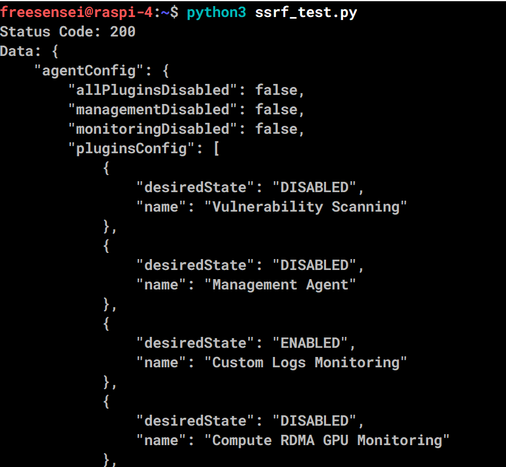

The retrieved data includes:
- Agent configuration settings
- Enabled and disabled plugins
- Monitoring and management configuration

This demonstrates that the metadata service is accessible from within the instance and can be queried programmatically.
This behavior is typical in SSRF attack scenarios, where internal services can be accessed indirectly through a vulnerable application.

Furthermore, it illustrates how an SSRF vulnerability could be abused to access internal services such as IMDS if proper protections are not in place.

However, the requirement of the Authorization: Bearer Oracle header indicates that additional security controls (similar to IMDSv2) are implemented to mitigate unauthorized access.

The metadata endpoint was initially tested and returned a restricted response:

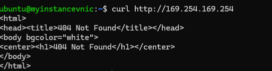

After adding the required authorization header, metadata could be retrieved:

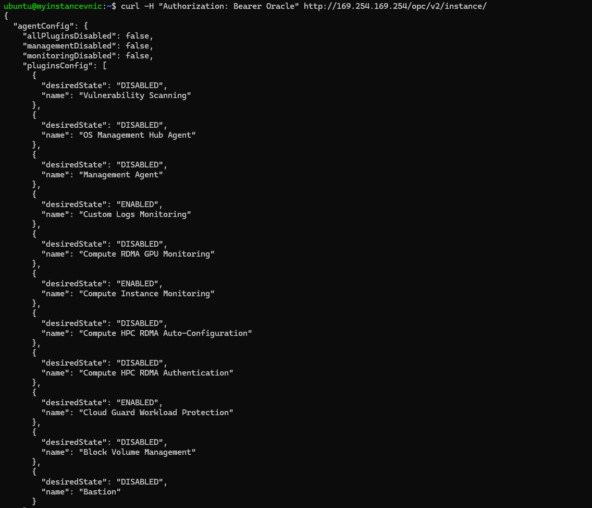

Finally, access was also demonstrated through an SSH tunnel, simulating SSRF-style access:

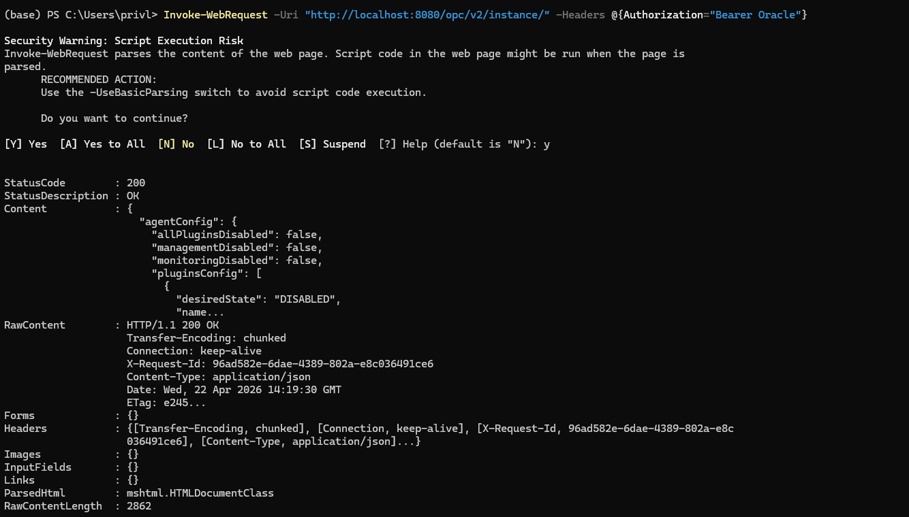


It was also tested whether metadata could be accessed via a web browser.

Direct browser access to http://169.254.169.254/opc/v2/instance/ is restricted and does not return useful data without the required Authorization header.

However, by using an SSRF-capable application or proxying the request (e.g., via SSH tunnel or script), it is possible to retrieve metadata programmatically.

This highlights the importance of restricting access to internal services, as SSRF vulnerabilities can bypass traditional network boundaries and expose sensitive cloud metadata.

#### d) How can we prevent the abuse of SSRF/IMDS attacks?
SSRF/IMDS attacks can be prevented by restricting access to the metadata service and securing how applications handle external requests.

Key protections include:
- Using authentication mechanisms (such as required headers) to protect metadata access
- Blocking access to 169.254.169.254 using firewall or network rules
- Validating and restricting user-supplied URLs (e.g. using allowlists)
- Applying least privilege to instance roles to limit impact if credentials are leaked
- Disabling metadata access if it is not required

These measures reduce the risk of attackers exploiting SSRF to access sensitive instance metadata.


## 5.4 Wireshark - Attack and Reconnaissance Signatures

### Questions
#### a) Using the osfingerprinting.pcap file make a Wireshark filter that displays all unique illegal ping packets.

**Filter used:**
`icmp.type == 8 && icmp.code != 0`


**Conclusion:**
This filter displays ICMP Echo Request packets (type 8) where the code is not equal to 0. Such packets are considered illegal and are commonly used in OS fingerprinting techniques.

**Figure 1:** Illegal ICMP Echo Requests identified in `osfingerprinting.pcap`.


#### b) Using active-scan.pcap and the illegal ping packet filter from task a. Try to find an ICMP echo request (type 8) packet with the wrong code value. What application ran the scan?

**Filter used:**
`icmp.type == 8 && icmp.code != 0`


**Result:**
An ICMP Echo Request (type 8) packet with an incorrect code value was identified. The ICMP code value was **19**.

**Conclusion:**
The scan was performed using **LANguard**, as it uses ICMP type 8 with code 19 for OS fingerprinting.

**Figure 2:** ICMP Echo Request with incorrect code value (19) in `active-scan.pcap`.


#### c) Using active-scan.pcap note the number of TCP resets, how many?

**Filter used:**
`tcp.flags.reset == 1`


**Result:**
Number of TCP reset packets: **636**

**Explanation:**
This indicates that many connection attempts were rejected by target hosts, which is typical behavior during active port scanning when closed ports respond with TCP reset packets.

#### d) Using active-scan.pcap, did the scanner look for any open UDP ports, if so which ones?

**Filter used:**
`icmp.type == 3 && icmp.code == 3`


**Result:**
ICMP Destination Unreachable (Port Unreachable) packets were observed.

**Ports scanned:**
161

**Conclusion:**
Yes, the scanner attempted to discover open UDP ports. The scan targeted port **161 (SNMP)**, as indicated by the ICMP port unreachable responses from the target system.

**Figure 3:** ICMP Port Unreachable response for UDP port 161 in `active-scan.pcap`.
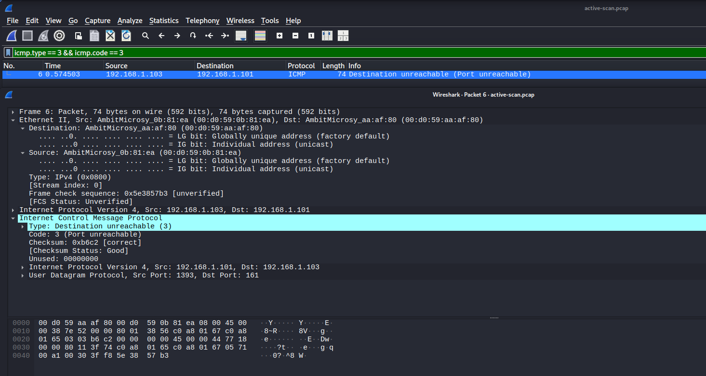


#### e) Using sick-client.pcap try to identify the bot information (user/nick, IP:port) the bot (bbjj.househot) use when connecting to its Botnet?

**Filter used:**
`tcp.port == 18067`


**Result:**
The TCP stream reveals IRC communication used by the bot.

**Nick/User:**
- Nick: p8-00196671  
- User: l l l l  

**Server:**
bbjj.househot (resolved to 61.189.243.240)

**IP and port:**
61.189.243.240:18067

**Conclusion:**
The bot connects to an IRC-based botnet command-and-control server using the nickname **p8-00196671** on port **18067**. The communication includes joining a channel, which indicates active participation in botnet activity.

**Figure 4:** IRC communication showing bot nickname and server connection in `sick-client.pcap`.
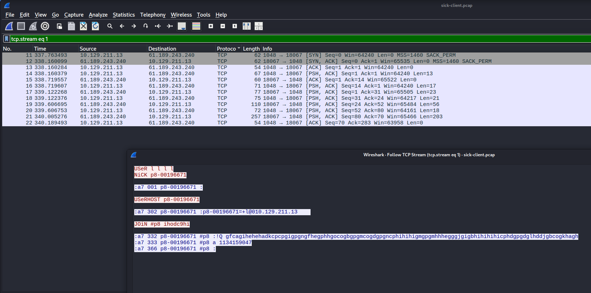


#### f) This is a capture from a compromised system which boots up, runs for just about 3 minutes, then CPU utilization hits 100% and the system locks up. Using clientdying.pcap describe what is happening? Hint! Start by looking at the protocols (Statistics > Protocol Hierarchy). We knew this client system didn’t talk RPC, IRC or TFTP. Typically finding those applications scream hacked!

**Analysis method:**
Statistics → Protocol Hierarchy

**Result:**
The Protocol Hierarchy shows communication using several unusual protocols for a normal client system, including:
- IRC (Internet Relay Chat)
- TFTP (Trivial File Transfer Protocol)
- DCE/RPC and SMB

**Explanation:**
The presence of IRC traffic indicates that the system is communicating with a botnet command-and-control server.  
TFTP traffic suggests that the system is downloading or transferring malicious files.  
Additionally, DCE/RPC and SMB activity may indicate attempts to propagate the infection across the network.

These protocols are not expected in normal client behavior, which strongly indicates that the system is compromised.

As the infection progresses, the system generates a large amount of network traffic. This excessive activity causes CPU utilization to reach 100%, eventually making the system unresponsive.

**Conclusion:**
The system is infected with malware and has become part of a botnet, resulting in abnormal network activity, resource exhaustion, and system failure.

**Figure 5:** Protocol Hierarchy showing suspicious protocols (IRC, TFTP, RPC) in `clientdying.pcap`.
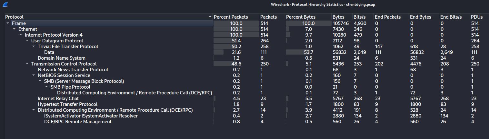

#### g) The arp-poison.pcap is a capture from a Man-in-the-middle attack. What IP and MAC address is the attacker having and who are the victims, explain for me please!?

**Filter used:**
`arp`


**Result:**
Multiple ARP reply packets show that the same MAC address is associated with multiple IP addresses.

**Attacker:**
- MAC address: 00:d0:59:aa:af:80

**Victims:**
- 192.168.1.1 (gateway)
- 192.168.1.103 (client)

**Explanation:**
The attacker performs ARP poisoning by sending forged ARP reply packets. These packets falsely associate the attacker’s MAC address with both the gateway IP (192.168.1.1) and the client IP (192.168.1.103).

As a result, both victims update their ARP tables and send their traffic to the attacker instead of directly communicating with each other. This allows the attacker to intercept, monitor, or modify the traffic between the two systems.

**Conclusion:**
The attacker successfully performs a Man-in-the-Middle attack by exploiting ARP protocol weaknesses, positioning itself between the client and the gateway.

**Figure 6:** ARP poisoning showing one MAC address mapped to multiple IPs in `arp-poison.pcap`.
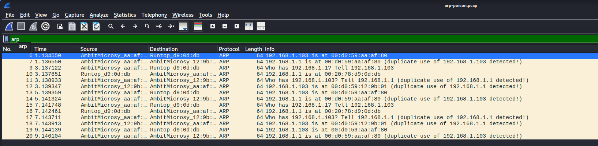


## 5.5 SANS - SEC565 Red Team Operations and Adversary Emulation

---

### 5.5.1 Forward SSH Tunnel

**Command:**
```bash
ssh -p 22 h23islag@maggie.du.se -L 5080:sqube-student.du.se:9000
```

Verification (HTTP request via tunnel):
`curl -H "Host: sqube-student.du.se" http://localhost:5080`

**Result:**

The SSH local port forwarding was successfully established.
Traffic sent to localhost:5080 was forwarded through the SSH tunnel to sqube-student.du.se:9000.
The HTTP response confirms that the web application is reachable via the tunnel.

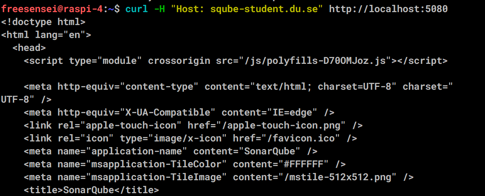


### 5.5.2 Socks proxy SSH tunnel
**Command:**
```bash
ssh -p 22 h23islag@maggie.du.se -D 9000
```

**Verification (curl via SOCKS proxy):**
```bash
curl -x socks5h://localhost:9000 http://sqube-student.du.se:9000
```

**Result:**
A dynamic SOCKS proxy was successfully created on `localhost:9000`.
Using `curl` with the SOCKS proxy confirms that traffic is routed through the SSH tunnel.
The returned HTML content verifies successful proxying.

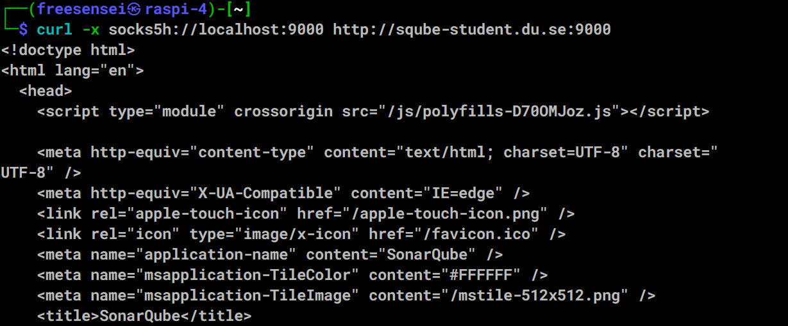

### 5.5.3 Multi-hop / Pivot SSH Tunnel 
**Note:**
In this case, the attack was executed from a Windows host using PowerShell.

**Command:**
- From Windows to external cloud VM (OCI):
```bash
ssh -i C:\Users\priv1\Documents\keys\ssh-key-2026-04-20.key -L 9000:localhost:9000 ubuntu@79.76.57.20
```
- From OCI VM to internal host (pivot):
```bash
ssh -L 9000:sqube-student.du.se:9000 h23islag@maggie.du.se
```
- Verification (from Windows with a new terminal):
```bash
curl http://localhost:9000
```

**Result:**
A multi-hop SSH tunnel (double pivot) was successfully established:

1. Windows → External VM (79.76.57.20)
2. External VM → Internal host (maggie.du.se)
3. Internal host → Target (sqube-student.du.se:9000)

This setup demonstrates a double pivot technique, where the attacker leverages an external cloud instance as an intermediary to reach internal network resources.

This allowed access to an internal web service from the attacker machine.
The HTTP 200 response and returned HTML confirm that the pivot chain is working correctly.

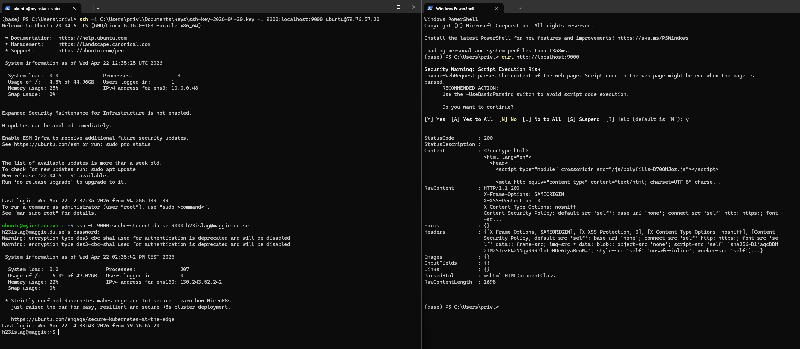


## 5.6 Reverse engineer managed code
**Tools used:**
- dnSpy (static analysis)
- Windows execution (dynamic testing)
- CyberChef (verification)

**Initial analysis:**
The file was identified as a PE32 executable and a Mono/.NET assembly using the `file` command. This indicates that the binary can be decompiled using .NET reverse engineering tools such as ILSpy or dnSpy.

**Analysis steps:**
1. Extracted the executable from the provided archive (esh.7z)
2. Identified the file as a .NET assembly
3. Opened the binary in dnSpy to decompile the code
4. Located the main form and analyzed the encoding/decoding functions

**Findings:**
The application is a GUI-based program that performs encoding and decoding of user input.

The encoding function:
`Convert.ToBase64String(Encoding.ASCII.GetBytes(input))`


The decoding function:
`Encoding.ASCII.GetString(Convert.FromBase64String(input))`


**Algorithm:**
The program uses **Base64 encoding and decoding**.

**Behavior:**
- User enters plain text in the left text box
- Clicking "Encode" converts the text into Base64
- Clicking "Decode" converts Base64 back into ASCII text
- The program validates input before decoding:
  - Input length must be a multiple of 4
  - Excess '=' characters are not allowed

**Verification:**
The encoding was verified using CyberChef.

Example:
- Input: aGVsbG8=
- Output: hello

CyberChef automatically detected the transformation as Base64 decoding, confirming the algorithm used in the application.

**Conclusion:**
The application implements a Base64 encoding/decoding algorithm. This technique is commonly used in web applications, email systems, and simple obfuscation methods in malware.

**Figure 7:** Decompiled code showing Base64 encoding/decoding functions in dnSpy.  
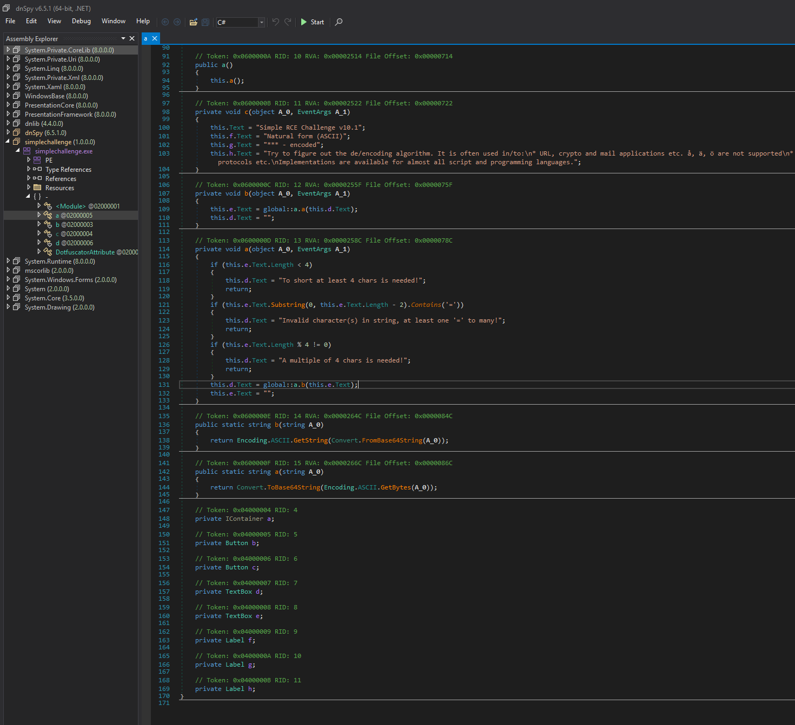

**Figure 8:** Program execution showing Base64 encoding result in the application.
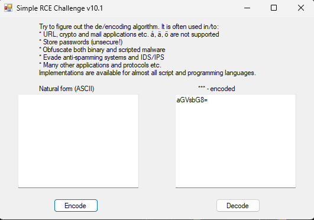

**Figure 9:** Base64 decoding verified using CyberChef.  
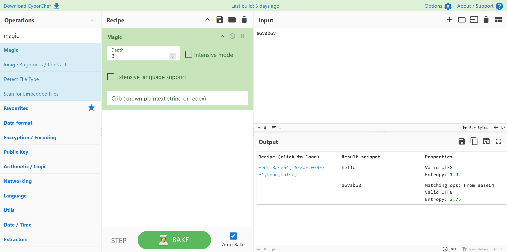


## 5.7 Analysis of an unknown binary file

**Tools used:**
- file
- strings
- UPX (unpacking)

---

### Initial analysis
The file was analyzed using:
`file esh`
`strings esh`


The file was identified as:
- ELF 32-bit Linux executable
- Statically linked
- Missing section headers (suspicious)

Initial analysis indicated that the binary was packed and obfuscated.

---

### Unpacking
The presence of the "UPX!" signature indicated that the binary was packed using UPX.

The file was successfully unpacked using:
`upx -d esh`


After unpacking, the binary revealed more readable strings and functionality.

**Figure 10:** UPX unpacking of the binary using `upx -d esh`.
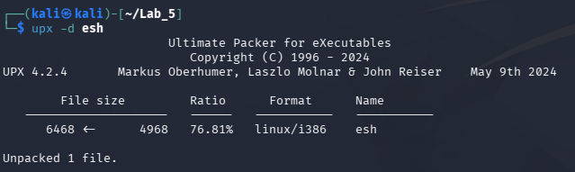

---

### Static analysis
The `strings` output revealed several key indicators of malicious behavior:

**Network functionality:**
- socket, connect, send, recvfrom, inet_addr  
→ Enables communication with a remote server

**System interaction:**
- fork, system, dup2, /bin/bash  
→ Indicates execution of shell commands and process creation

**System information gathering:**
- uname  
- System's name, Version, Process, Name host  

→ Collects host system information

**Stealth techniques:**
- HISTFILE=/dev/null  
- /dev/null  

→ Disables command history logging and hides activity

**Backdoor indicator:**
`BY SIMPP BACKDOORED SYSTEM INFO - cmd->`


→ Explicit indication of a backdoor with command execution capability

---

### Behavioral analysis (inferred)
Based on static analysis, the malware likely:

- connects to a remote command-and-control server
- sends system information (hostname, OS, etc.)
- receives commands from the attacker
- executes commands via `/bin/bash`
- hides traces of execution

---

### Malware classification
The analyzed binary is most likely a:

- **Linux backdoor / remote shell**
- possibly part of a botnet or remote access toolkit

---

### Conclusion
The file is clearly malicious.

It implements a backdoor that:
- establishes network communication
- gathers system information
- executes remote commands
- hides its activity

The presence of explicit strings such as:
`BY SIMPP BACKDOORED SYSTEM INFO - cmd->` confirms that the program is designed for unauthorized remote access and control of the infected system.


## Reflection

This lab provided practical insight into cloud attack surfaces, especially how misconfigurations and internal services such as IMDS can be abused through SSRF.

It also demonstrated the importance of network pivoting techniques in real-world offensive security scenarios.
